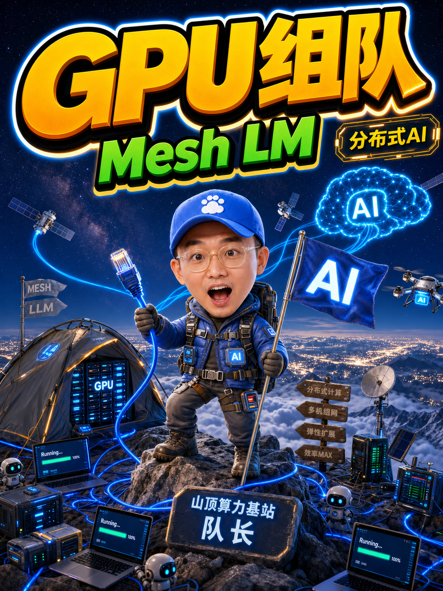
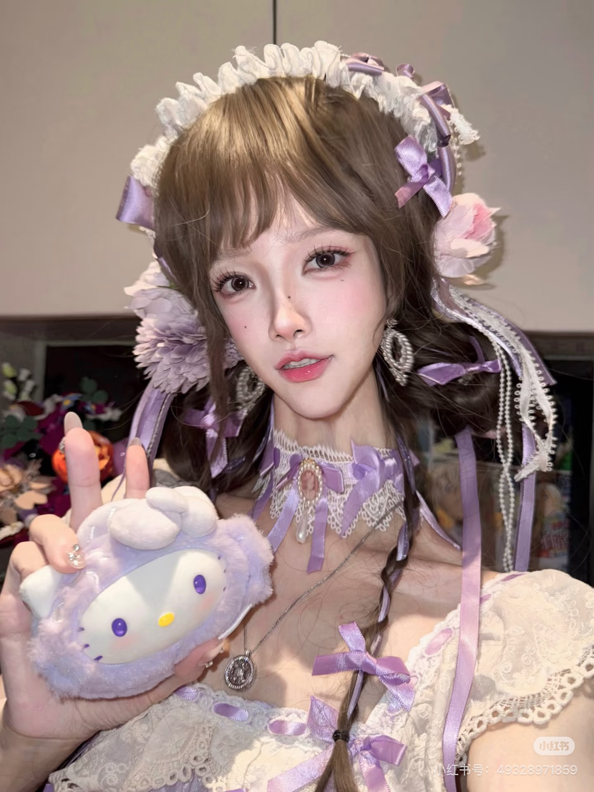

# 开心 3D 动漫封面

> 把 AI、工具、云服务与 B2B 主题，做成一眼想点开的中文 3D 动漫视觉封面。

<p align="center">
  
  
  
  
  
</p>

<p align="center">
  <strong>适用于小红书 · 抖音 · 视频号</strong><br />
  从选题、标题提炼、画面构图到中文排版，一次完成可发布封面。
</p>

---

## 它能做什么

| 你想要的结果 | 这个技能会交付 |
| --- | --- |
| AI 产品、工具测评或行业热点封面 | 主题化 3D 动漫场景与高辨识度角色 |
| 看起来很长、很难排的中文标题 | 先给可读性更强的标题提炼方案，再按你的选择排版 |
| 使用人物照片制作封面 | 仅使用你为本次任务提供的照片，保持人物一致性 |
| 已有封面但不够吸睛 | 保留核心信息，重新设计视觉叙事、层级和标题冲击力 |

## 真人照片 → 3D 动漫封面

<table>
  <tr>
    <th>真人照片</th>
    <th>生成封面</th>
    <th>真人照片</th>
    <th>生成封面</th>
  </tr>
  <tr>
    <td></td>
    <td></td>
    <td></td>
    <td></td>
  </tr>
</table>

<p align="center"><em>左为真人照片，右为生成的 3D 动漫封面。</em></p>

> 特别鸣谢小红书博主：**小菜果子o** 的美照，为本案例提供真人参考。

<table>
  <tr>
    <th>更多封面案例</th>
    <th>更多封面案例</th>
  </tr>
  <tr>
    <td></td>
    <td></td>
  </tr>
</table>

## 一句话开始

在 Codex 中直接说：

```text
使用 $kaixin-3d-anime-cover，做一张 3:4 的小红书封面。
标题：AI 时代，普通人如何把工作效率翻三倍？
```

也可以更自然地表达：

```text
帮我做一张开心风格的 3D 动漫封面，主题是「Claude Code 到底值不值得学？」
```

## 制作流程

从一句需求到可发布封面，技能会按下面的流程推进：

| 步骤 | 会发生什么 |
| --- | --- |
| 1. 确认标题 | 先确认你是否已有标题。若还没有，会根据文章、脚本或选题给出标题方向供你选择。 |
| 2. 处理长标题 | 中文主标题超过排版安全长度时，会给出一个更适合封面的大标题，并让你选择“保留原标题”或“使用提炼标题”。没有得到选择前，不会直接开始出图。 |
| 3. 确认素材 | 标题确定后，再确认人物照片、产品截图、真实 Logo、品牌色与满意样张；缺少的素材会明确标注，不会凭空伪造。 |
| 4. 设计画面 | 将产品功能转换为角色、场景和一秒能看懂的剧情，并确定构图、配色与中文标题的呈现方式。 |
| 5. 生成与检查 | 生成多张方向不同的封面，逐张检查标题是否完整、人物与手部是否自然、Logo 是否准确，以及手机缩略图下是否醒目。 |
| 6. 交付成品 | 输出可发布的 3:4 封面；只有你需要时，才额外提供提示词或制作说明。 |

> 你可以只给一句主题开始。技能会在需要你确认标题或补充关键素材时停下来问你，不会跳过这些环节直接产出。

## 安装

在终端运行下面的命令，即可将技能安装到本机的 Codex：

```bash
npx skills add Runzhi8341/kaixin-3d-anime-cover -g
```

安装完成后，新开一个 Codex 对话，输入 `$kaixin-3d-anime-cover` 或直接说“帮我做一张 3D 动漫封面”即可使用。

## 设计语言

- **3D 动漫叙事**：不做抽象的“科技背景”，而是为主题设计可讲故事的角色、动作与场景。
- **中文标题优先**：保证标题是画面的第一阅读入口，避免小字、乱码和无效堆砌。
- **强内容平台适配**：默认面向 3:4 竖版信息流，在小屏上依然有冲击力。
- **人物参考受控**：只有你在当前任务提供或明确授权的照片才会用于人物一致性参考，不保存为默认素材。

## 技能内容

| 目录 | 用途 |
| --- | --- |
| `SKILL.md` | 技能触发条件与完整制作流程 |
| `references/` | 画面、排版与设计流程指南 |
| `scripts/compose_cover.py` | 稳定生成中文标题排版的工具 |
| `assets/` | 已确认排版样张与可用字体资源 |
| `evals/` | 触发与交付质量的回归用例 |

## 使用边界

这个技能面向“完成一张可发布封面”或“重做现有封面”。它不用于纯 Logo、只有一句标题的简单文字需求，或仅输出提示词的场景。

---

<p align="center">
  <strong>让每个好选题，都有一张配得上的封面。</strong>
</p>
